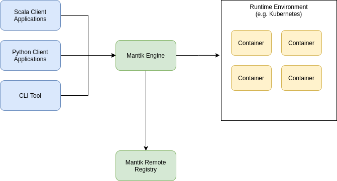
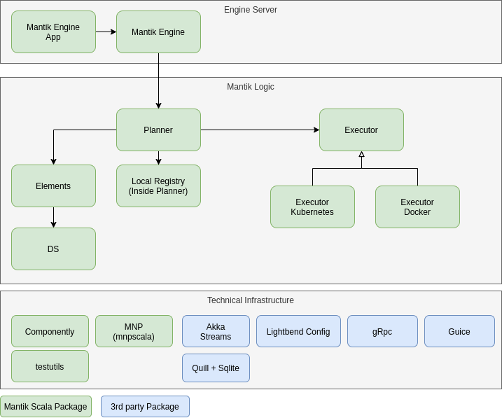

# Architectural Overview

The Mantik Core consists of various components, written in multiple languages. This document should give a
top down overview.

## Runtime Overview

Client Applications directly communicate with the permanently running Mantik Engine.

The communication contains

- Building new graphs for evaluation
- Executing evaluation graphs
- Deploying pipelines
- Accessing local registry features

The communication is done via gRpc.

The Mantik Engine is responsible for translating and optimizing requests into the runtime environment, e.g. Kubernetes.

Mantik Artifacts can be shared from a remote Mantik Registry (in Development).

Clients can be

- Scala Clients, using Planner features directly
- Python Clients (also Jupyter) using client code in `python_sdk`
- The Mantik Command Line Interface (`cli`), written in Go

## Engine Overview

Mantik Engine is the persistent running service, which make Evaluations and Deployments happen. 

The Engine listens to Port 8087 per default.

The Engine consists of multiple packages, which roughly correspond to 3 layers.

### The Engine Server

- `engine-app` The Engine Application (with it's Scala-Main)
- `engine` The Engine Library which pulls all dependencies and gRpc Servers.

### Mantik Logic

- `planner` The main Planning Tool (Building graphs of MantikItems) together with translation and execution.
- `local registry` Stores local Mantik Artifacts. Currently this is implemented inside the `planner` package.
- `executor` The Backends for Kubernetes and Docker
- `elements` Shared Data structures between Mantik Core and the Mantik Remote Registry (in Development).
- `ds` The data structure library.

### Technical Infrastructure

- `mnp/mnpscala` The Scala Implementation of the [Mantik Node Protocol](./Mnp.md) 
- `componently` Shared gRpc/Akka/Dependency Injection Code
- `testutils` Utility Code for unit tests.

#### 3rd Party

The engine is using some third party libraries:

- [Akka](https://akka.io) for asynchronous process running and streaming of data, also for HTTP support
- [Lightbend Config](https://github.com/lightbend/config) for Configuration
- [gRpc](https://grpc.io/) for RPC-Communication based upon Google Protobuf
- [Guice](https://github.com/google/guice) for Dependency Injection
- [Quill](https://getquill.io/) Quill (together with [Sqlite](https://www.sqlite.org/index.html)) for local database
  actions.

## Bridge Architecture

[Bridges](./Bridges.md) are responsible for abstracting away different frameworks for (trainable) algorithms and data sets.

In use, they are docker images, which implement the [MNP](./Mnp.md) protocol, together with special Mantik
Init functions.

Go Bridges are build using the `go-shared` library. Python bridges are built using the `python-sdk` library.

Mantik Core is shipping some default bridges in the `bridge` directory.

There is a special bridge called `select` which is used for SQL-like operations.
