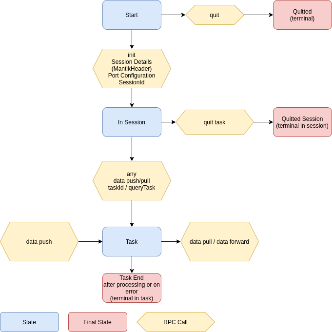

# MNP

MNP (Mantik Node Protocol) the communication protocol between Mantik Nodes.

It should solve the following requirements.

- Algorithm nodes can transform data on the fly. It's not necessary to receive all data in order to begin responding.
- Running bridges can be reconfigured.
- Only one docker container is needed for a Bridge.
- There must be a concept of a single task.
- The lifecycle of a Bridge can be controlled from the outside.
- The protocol can be tunneled via modern http proxies

## How MNP works

MNP is meant to be a transport protocol for nodes. It is not mantik specific.

Processes talking MNP have the following properties

- Some session can be startet
- Each session has a set of input and output ports
- Within a session, it is possible to push data into inport ports and read responses from output ports
- During session init, it is possible to wire output ports to other processes input ports. Data generated
  on this output nodes will be automatically forwarded.

## State Flow

By default, a MNP server begins listening and waiting for a session.

Once a init-session command is received, a session is being initialized. The init session call must define
the number of expected input and output ports. Mantik adds some Init-Configuration (MantikHeader for bridges and URL
of payload). If the Init-Session succeeds a new session is opened, in which a MNP node waits for input data.

The init-session call may also contain forwarding information, which makes all tasks forward their result data automatically
to another MNP node, saving data roundtrips.

Data is transferred using push-Calls and received using pull-Calls. All push and pull calls contain a `taskId`. The first
pull/push with an unknown `taskId` creates a Task in which data processing takes place. The Task lives as long as 
processing is done.

It's also possible to create a task with a Query-Task command. This is necessary for Nodes which only create data and
forward it.

The protocol is parallel and asynchronous

- Any number of sessions can be created in parallel
- Any number of tasks can be created in parallel inside a session
- Session Creation may take some time, this is reflected by a `stream`-Response.
- As tasks can be stuck, it's possible to investigate them using `queryTask`-call.
- Push and Pull are both using streamed asynchronous data.
 
## Implementation details

- The protocol is defined in `mnp/protocol/mnp.proto` and written as gRpc
- There are multiple implementations
  - Go Client and Server `mnp/mnpgo`
  - Python Server `mnp/mnppython`
  - Scala Client `mnp/mnpscala`  
- Mantik specific init data (payload, MantikHeader) must be placed into the `Any` objects 
- Mantik specific init data is defined in `bridge/protocol/protobuf/mantik/bridge/bridge.proto`

## Protocol Details

- Nodes are talking MNP on a given URL `mnp://node:networkport`
- Nodes can be requested to start a session, which is referenced by `mnp://node:networkport/sessionId`
  During session init, the requester can define the content type of all input and output ports
  and also forwarding rules
- Using Push/Pull messages with a `taskId` starts independent sub processes within the nodes.
- Input ports can also be referenced by a Url `mnp://node:networkport/sessionId/inputPort`
- The life cycle of all the node and of a session can be managed via special commands
